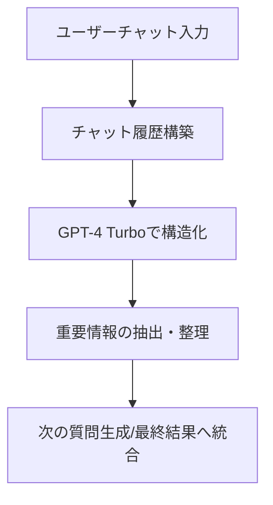
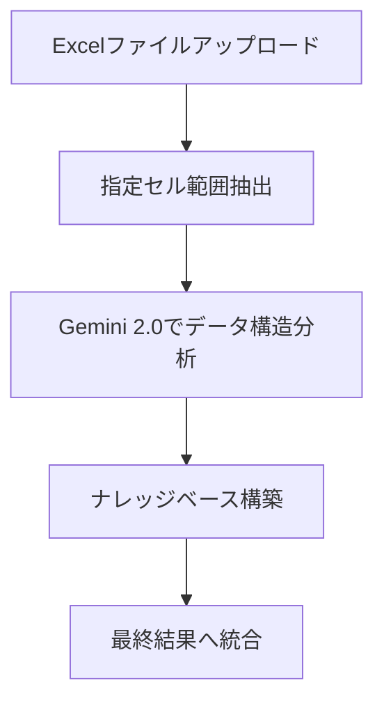
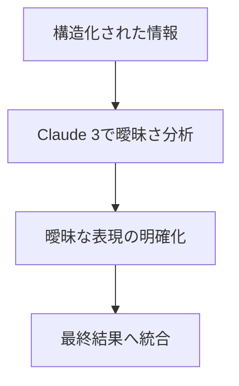
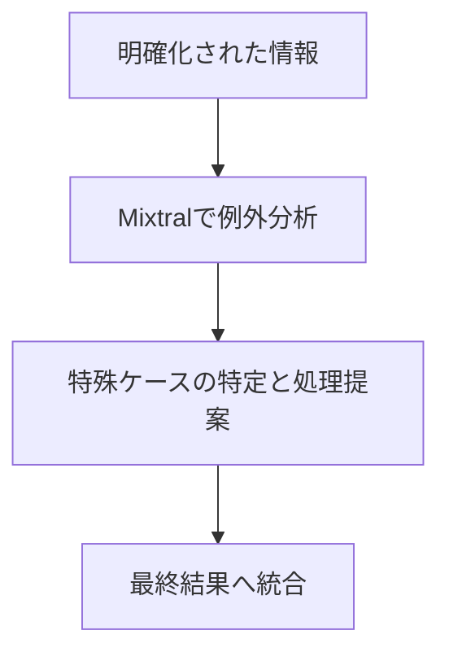

# LLM連携機能の詳細

このドキュメントでは、Mastra AI Excel VBA Generatorが使用する複数のLLMモデルの連携機能について詳細に説明します。

## 使用モデル一覧

アプリケーションは[OpenRouter API](https://openrouter.ai)を通じて以下のLLMモデルに接続しています：

| モデル | APIパス | 主な役割 |
|-------|---------|---------|
| GPT-4 Turbo | openai/gpt-4-turbo | チャット内容の論理的構造化 |
| Gemini 2.0 | google/gemini-pro | Excelデータ構造の分析 |
| Claude 3 | anthropic/claude-3-opus | 表現の曖昧さを明確化 |
| Mixtral | mistralai/mixtral-8x7b | 細かいニュアンスや例外処理の補完 |

## 各モデルの処理フロー

### 1. GPT-4 Turbo: チャット内容の論理的構造化
   


GPT-4 Turboはチャットの全体的な流れを管理し、ユーザーとの会話から重要な情報を抽出・整理します。また、最終的なVBAコード生成のメインモデルとしても機能します。

### 2. Gemini 2.0: Excelデータ構造の分析



Gemini 2.0は、アップロードされたExcelファイルのデータ構造を詳細に分析し、セル範囲の内容を理解します。この情報は最適なVBAコード生成のための重要な入力となります。

### 3. Claude 3: 表現の曖昧さを明確化



Claude 3は、ユーザー入力や抽出されたデータの曖昧な表現を特定し明確化します。これにより、より正確なVBAコード生成が可能になります。

### 4. Mixtral: 細かいニュアンスや例外処理の補完



Mixtralは、特殊なケースや例外的な状況を特定し、それに対する処理方法を提案します。これにより、生成されるVBAコードの堅牢性が向上します。

## 統合プロセス

4つのモデルからの出力は最終的に統合され、GPT-4 Turboを使用して最終的なVBAコードが生成されます。このプロセスにより、各モデルの強みを活かした高品質なコード生成が実現します。

## API設定

OpenRouter APIの設定は.envファイルで管理されています：

```
OPENROUTER_API_KEY=your_api_key_here
OPENROUTER_BASE_URL=https://openrouter.ai/api/v1
```

## エラーハンドリング

各モデルへのAPI呼び出しには包括的なエラーハンドリングが実装されており、API接続エラーが発生した場合でもアプリケーションが適切に対応します。エラーはログに記録され、ユーザーには適切なメッセージが表示されます。
